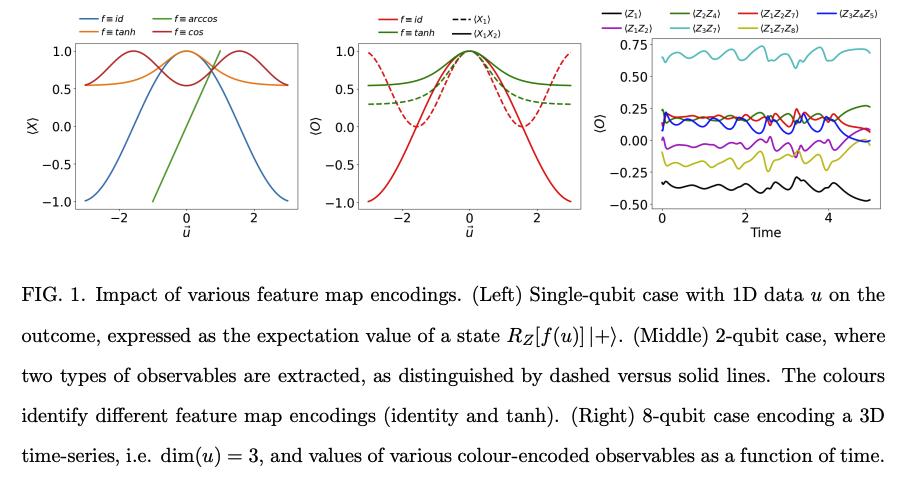
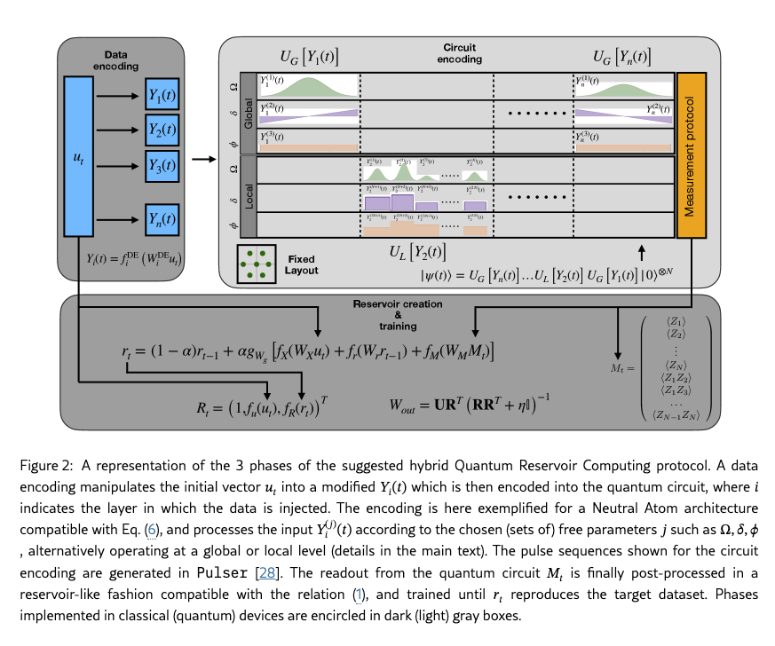
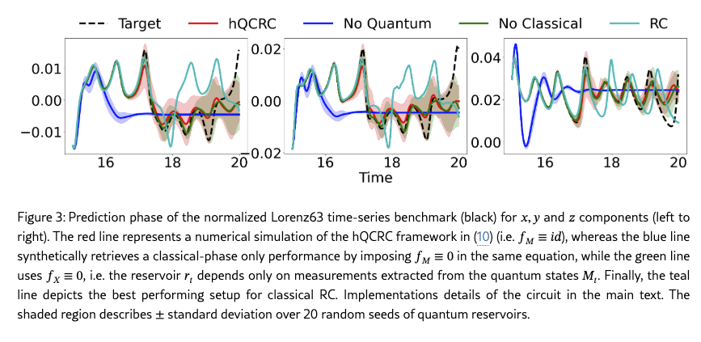

# QML

# Qu’est ce qu’un Reservoir ?

Quand on parle de Reservoir Computing il faut entendre 3 couches:

- Input : une simple couche qui contient l’input temporelle: $\bold{u(t)} \in R^d$ , connectée à la 2eme couche par une matrice $W_{in}$
- Couche Reservoir: c’est une “simple” fonction qui envoie $\bold{u(t)} \rightarrow \bold{r(t)} \in R^N$ , où N est le nombre de “neurones” >> d (dimension de l’input u).
    
    L’idée sous-jacente est d’envoyer l’input dans un espace de dimension bien plus grand, dans lequel les dépendances non-linéaire sur $\bold{u(t)} \in R^d$ deviennent linéairement séparable sur $\bold{r(t)} \in R^N$. C’est une sorte de Kernel trick bien connu pour les SVM, mais ici le kernel (F) est dynamique.
    
    Formellement, en notant $W_{rec}$ la matrice de connexion entre les neurones, la couche réservoir est la fonction (non apprise → c’est toute la beauté):
    
    $$
    r_t = \bold{F}(u_t, r_{t-1}; W_{rec})
    $$
    
- Une couche de lecture : étant donné que $\bold{F}$ projete les données dans un espace suffisement grand pour que les features soient linéairement séparables, il suffit de “brancher” n’importe quelle type de regression/classifieur linéaire en sortie pour “lire” l’etat du reservoir et prédire ce qu’il y a à prédire ($u_{t+1}$, classe d’appartenance).

# Un reservoir quantique ?

The underlying idea is straightforward: quantum states live in exponentially
large Hilbert spaces ($2^n$ avec n le nombre de qubits), making them natural candidates for generating high-dimensional representations suitable for training a linear readout.

Nous venons de voir que la matrice $W_{rec}$ doit permettre une connexion aléatoire entre les neurones, en termes quantiques il faut que les qubits puissent facielement se “connecter” entre eux. L’etude sur laquelle repose cet écrit, utilise des atomes froids comme qubits et met en avant la forte capacité d’interactions des qubits grace au Lattices of Ridberg atoms.

### Quantum feature map et Ansatz

C’est un probleme clé en Quantum machine learning lorsque l’on travaille à partir de données classiques. L’idée est d’utiliser une quantum feature map pour transformer un input classique u en un etat quantique :

$$
u \in R^n \rightarrow \ket{\psi (u)}
$$

Ce mapping est concrétement réalisé par un circuit quantique appelé Ansatz.

Il est important de ce demander comment intégrer de la non-linéarité dans le (quantum) reservoir sachant que toutes opérations sur les qubits sont Unitaires. Réponse: dans la feature map, et en faisant des mesures dans le reservoir.

Exemple : 

- f(u) = cos(u)
- f(u) = tanh(u)

### Mesures des features

La feature u peut etre (partiellement) recupéré en calculant le valeur moyenne de l’observable adéquat.

Ici typiquement ils partent de $\ket{+}$ et appliquent la porte $R_Z(f(u))$ sur $\ket{+}$. La valeur moyenne de l’obsersable X est donc: $cos(f(u))$.

Cela souleve plusieurs problemes et complication comparé au reservoir classique:

- La mesure perturbe le systeme, il faut mesurer plusieurs fois le systeme complet pour avoir une estimation de la moyenne (perte de temps).
- Il faut donc que le reservoir se souviennent de l’etat passé (fading memory) tout en sachant qu’a chaque fois qu’on “lance” le reservoir, on repart d’un meme etat initial et on moyenne à coup de plusieurs iterations.

C’est pourquoi l’approche apporté dans le papier est une approcha hybride mélant “mémoire et apprentissage” classique, et dynamique quantique.

# Hybrid Reservoir

Dans le cadre de ce papier, ils ont proposé une modularité permettant à la fois d’utiliser une  partie classique et une partie quantique.

Dans le schema ci-dessous, l’entrée classique u(t) est utilisé à la fois dans la formule d’etat du reservoir hybride $R_t$, et à la fois comme point d’entrée pour construire n features $Y_l(t)$ ou chaque $1 \leq l \leq n$, et $n$ représente le nombre de couches (opérations) quantiques. La transformation des input u(t) en $Y_l(t)$ est une feature map faite de maniere séquentielle.

L’etat quantique finale est $|\psi(t)\rangle=U_G\!\left[Y_n(t)\right]\cdots U_L\!\left[Y_2(t)\right]U_G\!\left[Y_1(t)\right]|0\rangle^{\otimes N}$

Il est utilisé pour “construire” un vecteur de mesure $M_t$, utilisé dans l’equation d’etat du reservoir.

# Résultats

Le modele a été utilisé pour faire de la prédiction sur un systeme dynamique bien connu: l’attracteur de Lorenz. Le but est de prédire les 3 coordonnées x,y,z au fur et a mesure du temps.

Pour mener l’experience ils ont simulé un reservoir hybrid avec 8 qubits.

Ci-dessous la phase de prédiction en cycle fermée (la prediction est réinjecter en entrée) des differents modeles (avec ou sans quantum):

# Interpretation

L’apport du quantique dans un reservoir a toute sa place, et l’experience menée sur l’attracteur de Lorenz le montre assez bien. Cependant, les implémentations actuelles de reservoir quantique ne sont pas agnostiques à la technologie de qubits (ici atomes neutres). De plus la simplicité propre du reservoir, comme simple systeme dynamique aléatoire permettant de transformer des données intriquées de maniere complexe, en représentation latente dans laquelle elles sont linéarisable, faisait la force du reservoir classique. Dans le cas quantique, l’approche avec une mesure totale (projective) sur le systeme et les shots successifs, écrasent et complexifie la simplicité du reservoir. 

L’apport du quantique dans les modeles de types reservoir est indéniable, mais la bonne méthode n’est pas encore au point.

# Bibliographie

[**From quantum feature maps to quantum reservoir computing: perspectives and applications**](https://arxiv.org/pdf/2510.01797v1)

[s41534-023-00682-z.pdf](QML/s41534-023-00682-z.pdf)