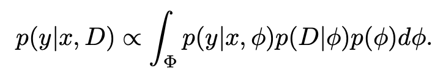

# TabPFN

# Introduction

TabPFN est un modele de type Transformer, entrainé sur des datasets tabulaires.

Soit un Dataset tabulaire $D$, splitté en Train/Test :

- $(X_{train}, y_{train})$
- $(X_{test}, y_{test})$

En phase **d’inférence**, on lui donne en entrée:

1. Le dataset d’entrainement, entrée + labels: $(X_{train}, y_{train})$
2. Les entrée du dataset de test : $(X_{test})$

Le modele output : $y_{test}$, où les y sont des variables discretes.

En realité le modele output : 

$p(y_{test} | x_{test}, D) \in \mathbb{R}$, mais cette valeur continue est ensuite utilisé pour approximer une classe discrete.

## Prior data Fitted Network (PFN)

### “Prior”:

C’est une croyance initiale sur les modeles pausibles avant de voir les données.

Si on suppose un mécanisme générateur $\phi$ → prior = $p(\phi)$

### “Posterior”

Apres avoir vu les données D, on met a jour notre “hypothese” $\phi$:

$p(\phi |D)$

### Cas du TabPFN:

Dans le papier ils utilisent un prior de type “Structural Causal Models” (SCM). Alors $\Phi$ est l’espace des SCM et une hypothese $\phi$ est un élément (sample) de $\Phi$. A partir de ce $\phi$ on génére un dataset D composé 

- d’une partie labellisée $D_{train} = \{ (x_i, y_i \}$
- d’une partie non labellisée à prédire $D_{test} = \{x_{test} \}$ ou on cherche à apprendre le PPD (**Posterior Predictive Distribution**)  $p(.|x_{test}, D_{train})$

## Synthetic Prior Fitting

Phase d’entrainement du transformer: l’entraienr sur des millions de dataset générés depuis un prior probabiliste afin qu’ils apprennent directement l’inférence bayesienne.

La phase de génération de Datset : $D$   → $p(D | \phi)$ 

## Loss Function = Cross-Entropy

Soit $q_{\theta}$ le modele appris par le modele.

Alors : $Loss = \mathbb{E}[-log(y_{test}|x_{test}, D_{train})]$.

# Phase d’entrainement

Leur approche est radicalement differente des approches actuelles sur les datasets tabulaires. Au lieu d’apprendre les targets à partir des features d’un Dataset, ils entrainent un gros Transformers sur des datasets tabulaires synthétiques UNE SEULE FOIS. 

# Bibliographie

https://arxiv.org/pdf/2207.01848